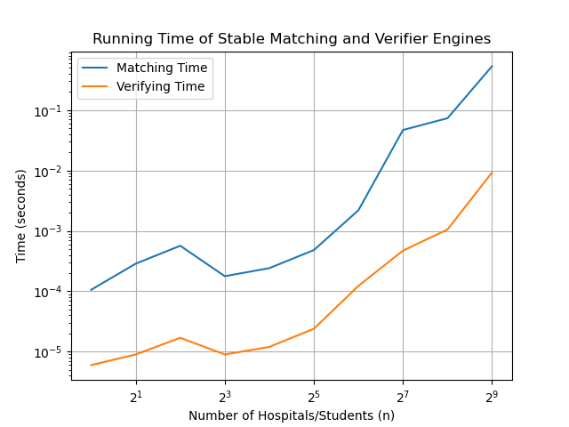
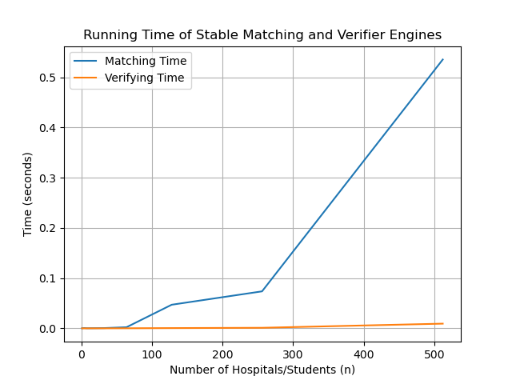

# Gale-Shapley Stable Matching

Pythonic Implementation of the Gale Shapley Algorithm for choosing stable matching pairs. Part of COP 4553: Algorithm Abstraction and Design at the University of Florida.

## Authors

- Nicholas Farr UFID: 17993779
- Trevor Gross  UFID: 11440394

## Project Structure

```
galeshapley/
├── src/
│   ├── stablematching.py    # Main matching algorithm, helper functions
│   ├── verifier.py          # Verifies stable matching output. Can run single .in files through this code to verify validity 
│   └── scalability.py       # Scalability analysis/benchmarking. File used for testing efficiency and scale of our algorithm.
├── data/                    # Input test files
└── out/            # output test files and graphs
```


        
## Prerequisites

- Python [version, e.g., 3.10+]
- List of dependancies in Requirements.txt 
- Install using this command : pip install -r requirements.txt

#### Data Formatting 

The input data must be formatted as follows:
- Line 1: $n$, where $n$ is a number correspoding to the number of hospitals/students that the algorithm will match
- Lines 2 to $n + 1$: an $n \times n$ matrix where each row corresponds to the hospitals prefrences in students, numbers $1$ to $n$
- Lines $n + 2$ to $2n + 1$: another $n \times n$ matrix where each row corresponds to the students prefrences in hospitals, numbers $1$ to $n$

The output data will be formatted as follows:
- Lines 1 to $n$: pairings  where the first column contains the hospital number $1$ to $n$ and the second column contains the student number $1$ to $n$


### Running the Algorithm

To run the G-S algorithm:
- Place desired input data into the `data/example.in` file, by the formatting guidelines above
- Run the following script in the terminal: `python src/verifier.py`
- Examine the output generated in the `out/pairings.out` file

To run the scalability experiment:
- Run the following script in the terminal: `python src/scalability.py`
- Examine the output graphs (logarithmically-scaled or not) generated in the `out/` directory

### Results and Reproducing Scale Experiment 

To run the G-S algorithm:
- Place input data into the `data/example.in` file, shown below
```
3
1 2 3
2 3 1
2 1 3
2 1 3
1 2 3
1 2 3
```

- Run the following script in the terminal: `python src/verifier.py`
- Examine the output generated in the `out/pairings.out` file, matching the output below
```
1 1
2 2
3 3
```

### Results and Trends




#### What is the trend that you notice?
The G-S algorithm is $O(N^2)$, as in our plots small inputs might look noise due to Pythons interpreter, however the curve smoothing out as the input size grows shows the quadratic time complexity of the algorithm. It can be observed from the graph that the change in time for matching and verification increases quadratically as $n$ increases. This is apparent in both the log and regular plots.


